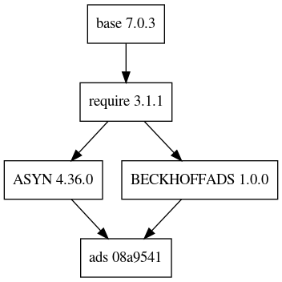

e3-ads  
======
ESS Site-specific EPICS IOC Application : ads

## Dependency Plot


||
| :---: |
|**Figure 1** Depdendency Tree. |


## Beckhoff ADS

We treat this Library as the Vendor library within e3. So this module has two git submodule links for twincat-ads and Beckhoff ADS. We only test this module within host `linux-x86_64` only. 


## Commands

* Change the four variables in `configure/CONFIG_MODULE` according to what you want to. 

```
EPICS_MODULE_TAG:=master
E3_MODULE_VERSION:=master
ADS_MODULE_TAG:=7df1d60
ADS_MODULE_VERSION:=7df1d60
```

* Two steps are necessary to compile e3-ads
```
make init
make adsall
make rebuild
```

## Detailed Commands
The following commands are used to do all procedure one by on.

* A patch file is needed to compile ADS as a shared lib.

```
make adsvers
make adsinit
make adspatch
make adsbuild
```

* The shared library are bounded into the final e3 shared library.

```
$ make init
$ make build
$ make install
```

